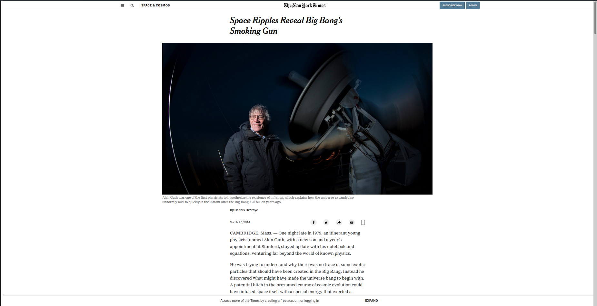

# SignUp Page

> This project contains a clone of mint.com's signup page.

## Built With

- HTML
Designed in Semantic HTML style.

-CSS
Heavy use of Flexbox

## Live Demo

[Live Demo Link](https://smcommits.github.io/TheNewYork-Times/)

## Getting Started

**User has to clone the repository and run index.html file using any web browser*

## Authors

👤 **Anas Siddiqui**

- GitHub: [Anas Siddiqui](https://github.com/smcommits)

## 🤝 Contributing

Contributions, issues, and feature requests are welcome!

Feel free to check the [issues page](issues/).

## Show your support

Give a ⭐️ if you like this project!

## Acknowledgments

- Icons are downloaded from Youtube's original page.
- Fonts are imported from Google Fonts.

## 📝 License

This project is [MIT](lic.url) licensed.
